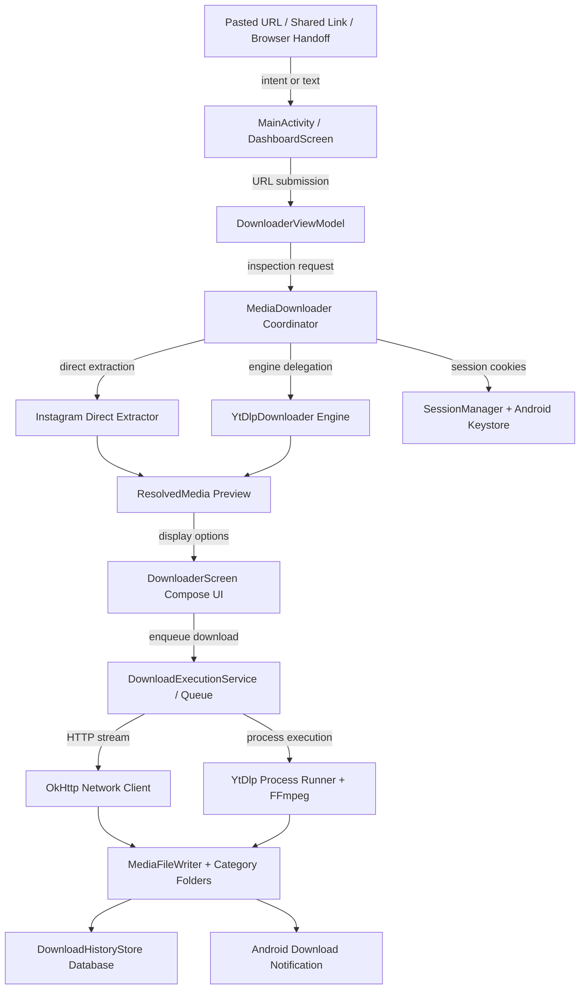

# Acqua - Developer Documentation

> Architecture, implementation notes, conventions, and verification guidance for Acqua development.

**Version:** 0.1.2 | **Last Updated:** 2026-08-30
**Scope:** Internal development, media downloader architecture, UI paradigms, testing, and release maintenance.

---

## Table of Contents

- [Architecture Overview](#architecture-overview)
- [Key Architectural Decisions](#key-architectural-decisions)
- [Technology Stack](#technology-stack)
- [Project Structure](#project-structure)
- [Runtime Flow](#runtime-flow)
- [Core Concepts](#core-concepts)
- [Navigation & State](#navigation--state)
- [Dual Download Engines](#dual-download-engines)
- [In-App Browser & Live Session Lifecycle](#in-app-browser--live-session-lifecycle)
- [Authenticated Sessions & Keystore Security](#authenticated-sessions--keystore-security)
- [Storage, Filename Formatter & History Database](#storage-filename-formatter--history-database)
- [UI & Design System](#ui--design-system)
- [Feature Deep Dive](#feature-deep-dive)
- [Naming Conventions](#naming-conventions)
- [Configuration](#configuration)
- [Security & Privacy Practices](#security--privacy-practices)
- [Error Handling](#error-handling)
- [Testing Suite](#testing-suite)
- [Build & Release Engineering](#build--release-engineering)
- [Intended Changes & Anomalies](#intended-changes--anomalies)
- [Project Auditing & Quality Standards](#project-auditing--quality-standards)
- [Troubleshooting](#troubleshooting)
- [Maintenance Notes](#maintenance-notes)
- [Feedback](#feedback)

---

## Architecture Overview

Acqua is built with clean MVVM architecture, unidirectional data flow (UDF), Kotlin Coroutines, StateFlow-backed UI state, and decoupled media extraction engines.



---

## Key Architectural Decisions

| Decision | Rationale |
| :--- | :--- |
| **Decoupled Dual Engines** | Acqua provides a native fast-path extractor for direct carousel and photo posts alongside a full-featured `yt-dlp` runtime for complex video, audio extraction, format conversion, and metadata embedding. |
| **Persistent In-App Browser** | The browser runs in a dedicated full-screen overlay above the main dashboard. Downloading from a live page or returning preserves navigation history, active sessions, and DOM state without reload overhead. |
| **Hardware-Backed Session Security** | Cookies and session state copied for background network requests are encrypted at rest using AES-256-GCM keys managed by the Android Keystore. |
| **Material 3 Expressive System** | Settings and info screens use `SegmentedListItem` with dynamic outer/inner corner radius calculation (`expressiveSegmentedShapes`), providing modern Android presentation. |
| **Composite Build-Logic Verification** | Enforces strict release metadata checks, production string validation, and version catalog freshness via an isolated Gradle build-logic convention plugin. |
| **Zero Telemetry by Design** | No analytics, ad SDKs, or remote tracking libraries are included. Network traffic is strictly limited to user-initiated preview and media download streams. |
| **Categorized Media Bucketing** | Automatically routes downloaded files into organized `Images/`, `Videos/`, and `Audio/` subfolders based on verified MIME types. |
| **Searchable Local History Store** | Persists completed download metadata, hashes, and file paths locally to enable instant search, sharing, and re-download recovery if a file is moved. |

---

## Technology Stack

| Area | Technology |
| :--- | :--- |
| **Language & Toolchain** | Kotlin 2.4.10, Java 21 Gradle daemon, JVM 11 bytecode target, Gradle 9.5.0, Android Gradle Plugin 9.3.1 |
| **Android Platform** | compileSdk/targetSdk 37, minSdk 24 (Android 7.0+), AndroidX Core KTX, Activity Compose, Lifecycle Runtime |
| **UI & Styling** | Jetpack Compose BOM 2026.08.00, Material 3 1.5.0-alpha26, Material 3 Adaptive 1.3.0, Material Icons Extended |
| **Networking & HTTP** | OkHttp 4.12.0, Kotlin Coroutines, Flow |
| **Media Extraction & Processing** | youtubedl-android, yt-dlp, FFmpeg native runtimes, QuickJS-Android, Python runtime |
| **Security & Storage** | Android Keystore (AES-GCM), SharedPreferences/DataStore, Storage Access Framework |
| **Testing** | JUnit 4, AndroidX Test, Robolectric, Kotlinx Coroutines Test, Turbine |

Versions are centralized in [`acqua-app/gradle/libs.versions.toml`](file:///X:/Github/acqua/acqua-app/gradle/libs.versions.toml).

---

## Project Structure

```text
acqua/
├── assets/                                      # Repository branding and SVG logos
├── docs/                                        # Static project documentation website
│   ├── index.html                               # Landing page, live GitHub counters, Bento grid, Credits, FAQ
│   ├── styles.css                               # Responsive styling, typography, mobile viewport fixes
│   └── scripts.js                               # Live GitHub stars/downloads fetcher with cubic easing
├── acqua-app/
│   ├── build-logic/                             # Convention plugins and verification tasks
│   │   └── src/main/kotlin/
│   │       └── AcquaAndroidApplicationConventionsPlugin.kt
│   ├── gradle/
│   │   └── libs.versions.toml                   # Centralized version catalog
│   ├── app/
│   │   ├── src/main/java/dev/qtremors/acqua/
│   │   │   ├── MainActivity.kt                  # Main entry point and URL intent receiver
│   │   │   ├── data/                            # Network downloader, cookie storage, history persistence
│   │   │   │   ├── network/                     # MediaDownloader, OkHttp clients, URL resolvers
│   │   │   │   └── repository/                  # AppSettingsRepository, DownloadHistoryStore
│   │   │   ├── domain/                          # Media item entities, formats, resolutions
│   │   │   ├── downloader/                      # Direct extractor, yt-dlp bridge, filename formatter
│   │   │   ├── feature/
│   │   │   │   ├── DashboardScreen.kt           # Primary bottom navigation shell
│   │   │   │   ├── downloader/                  # Downloader screen, preview cards, quality sheet
│   │   │   │   ├── browser/                     # In-app browser, bookmark manager, floating controls
│   │   │   │   ├── history/                     # Download history, filters, sharing, search
│   │   │   │   ├── settings/                    # Settings screen and preference viewmodels
│   │   │   │   └── about/                       # About screen, Open Source notices, legal dialogs
│   │   │   └── ui/
│   │   │       ├── theme/                       # Color.kt, Shape.kt (ExpressiveShapes), Spacing.kt, Theme.kt
│   │   │       └── components/                  # SettingsSection, SettingsListItem, Segmented cards
│   │   └── src/test/java/                       # Comprehensive unit test suites
├── CHANGELOG.md                                 # User-visible version changelog
├── DEVELOPMENT.md                               # Architecture & development guide (This Document)
├── LICENSE.md                                   # GNU General Public License v3 or later
├── PRIVACY.md                                   # User-facing privacy policy
├── TASKS.md                                     # Prioritized task queue
└── THIRD_PARTY_NOTICES.md                       # Runtime component licensing and credits
```

---

## Runtime Flow

1. **Launch & URL Ingestion:** `MainActivity` initializes the Compose runtime, sets up window insets, and checks for incoming `ACTION_SEND` or `ACTION_VIEW` intents. Incoming URLs are sanitized and handed off directly to `DownloaderViewModel`.
2. **Pre-Resolution & Inspection:** When a link is entered, `MediaDownloader` dispatches the request to the matching engine. It extracts title, author, duration, thumbnail image, available video resolutions, and audio streams without downloading full files.
3. **Configuration & Options:** The user reviews preview cards in `DownloaderScreen`. Quality options (e.g. 1080p vs 720p, Original vs MP3, metadata embed) are selected via the options sheet.
4. **Queueing & Foreground Service:** Tapping **Download** enqueues the request. A foreground service with persistent notification tracking manages the active downloads, reporting byte progress, speed, and ETA.
5. **Validation & Finalization:** The downloaded stream is verified for MIME integrity, formatted according to the active filename template (e.g. `{title} - {author}`), and written to the selected subfolder (`Images/`, `Videos/`, `Audio/`).
6. **Notification & History Indexing:** Upon completion, a high-priority system notification with tap-to-open and share actions is posted, and the item is indexed in `DownloadHistoryStore`.

---

## Core Concepts

### Download Engines

- **Acqua Direct Extractor:** Fast, zero-overhead HTTP client tailored for direct media links and multi-item carousels.
- **yt-dlp Engine:** Python-based extraction runtime capable of stream demuxing, video/audio transcoding, chapter marking, and cover artwork injection.
- **Engine Selection:** The user can toggle between Acqua and yt-dlp directly on the download bar or configure automatic fallback.

### Filename Templating Engine

Acqua supports customizable filename formatting via `FilenameFormatter`:

| Variable | Description | Example |
| :--- | :--- | :--- |
| `{title}` | Title of the media item | `Scenic Sunset` |
| `{author}` | Uploader or channel name | `nature_captures` |
| `{id}` | Unique video/post ID | `C_4x9LmZ1` |
| `{date}` | Publication timestamp (YYYYMMDD) | `20260830` |
| `{ext}` | Normalized output extension | `mp4` |

---

## Navigation & State

Acqua uses single-activity architecture with stateful composable screens managed by `DashboardScreen`:

- **Navigation Tabs:** Fixed bottom navigation with 4 destinations:
  - `Downloader`: Link entry, preview carousel, download progress, and configuration sheet.
  - `Browser`: In-app browser with bookmarks and floating download controller.
  - `History`: Filterable, searchable download archive with missing-file recovery.
  - `Settings`: Grouped configuration for subfolders, filenames, media quality, and engine updates.
- **Overlay Navigation:** Sub-destinations (About, Open Source Notices, Legal Documents) render as nested screens with back-handler integration.

---

## Dual Download Engines

Acqua encapsulates its extraction strategies behind the `MediaDownloader` domain interface:

1. **Inspection Phase:** Inspects URL patterns to select the optimal extractor.
2. **Session Injection:** If authenticated browser sessions are enabled, matching cookies for the target host are securely injected.
3. **Execution Routing:**
   - Single direct URLs run over pure OkHttp coroutine streams.
   - Complex multi-format or conversion requests run through `YtDlpDownloader`, streaming output logs for progress parsing.
4. **Failure Recovery:** If direct extraction fails with restricted content, Acqua prompts the user to open the link in the built-in browser to authenticate.

---

## In-App Browser & Live Session Lifecycle

- **Persistent Surface:** The browser activity runs above the dashboard stack. Opening a download from a page does not destroy or reload the browser.
- **Floating Controls:** A draggable pill overlay provides quick actions: Refresh, Download from Current URL, and Return to Acqua.
- **Bookmark Management:** Bookmarks save custom titles, URLs, and favicons, supporting touch-and-hold editing and fast one-tap navigation.

---

## Authenticated Sessions & Keystore Security

- **Credential Isolation:** Login happens strictly within Android WebView. Acqua never requests or captures user passwords.
- **Hardware-Backed Encryption:** Saved cookie jars used for background extraction are encrypted using AES-256-GCM keys backed by the Android Keystore.
- **Granular Data Management:** The **Manage Website Data** screen allows users to delete cookies, cache, local storage, and HTTP authentication records per domain or wipe all shared data with one tap.

---

## Storage, Filename Formatter & History Database

### Category Subfolder Bucketing
When **Organize into media folders** is enabled:
- Images are saved to `Downloads/<Subfolder>/Images/`
- Videos are saved to `Downloads/<Subfolder>/Videos/`
- Audio tracks are saved to `Downloads/<Subfolder>/Audio/`

### Download History Store
- Uses a local SQLite database caching file path, size, URL, media type, thumbnail path, and completion timestamp.
- Detects deleted or moved files in shared storage and provides a **Download again** action.

---

## UI & Design System

Acqua implements **Material 3 Expressive** design tokens and grouped list presentation:

### 1. Shape Tokens (`ui/theme/Shape.kt`)
- `ExpressiveShapes`: Semantic corner scales (`extraSmall = 4.dp`, `small = 8.dp`, `medium = 16.dp`, `large = 24.dp`, `extraLarge = 28.dp`).
- `expressiveSegmentedShapes(index, count)`: Computes 24dp outer corners and 4dp inner segment corners for modern Android grouped lists.

### 2. Spacing Tokens (`ui/theme/Spacing.kt`)
- `LocalSpacing` provides centralized coordinates (`screenGutter = 16.dp`, `cardPadding = 16.dp`, `segmentedGap = 2.dp`).

### 3. Grouped UI Primitives (`ui/components/`)
- `SettingsSection`: Semantic bold section header with 2dp item gaps.
- `SettingsSwitchRow`: Accessible `SegmentedListItem` switch row with merged switch semantics (`Role.Switch`).
- `SettingsActionRow`: Accessible clickable `SegmentedListItem` with trailing indicators.
- `SettingsCardContainer`: Expressive container card matching outer corner radii.

---

## Feature Deep Dive

### 1. Downloader (`feature/downloader`)
- Owns URL input parsing, preview cards, quality sheet, and active download progress.

### 2. Browser (`feature/browser`)
- Owns WebView container, bookmark manager, floating action pill, and cookie session extraction.

### 3. History (`feature/history`)
- Owns search filtering, category tabs (All, Photos, Videos, Audio, Links), file sharing, and history clearing.

### 4. Settings (`feature/settings`)
- Owns downloads subfolder, category organization toggle, filename template builder, media quality selectors, yt-dlp auto-updater, and WebView provider diagnostics.

### 5. About (`feature/about`)
- Owns app information, device diagnostics, version copy action, privacy policy, and open-source licenses catalog.

---

## Naming Conventions

### Directory & File Names
- **Compose Screens:** PascalCase with `Screen` suffix (e.g. `SettingsScreen.kt`).
- **Composables:** PascalCase without suffix (e.g. `SettingsSection.kt`).
- **ViewModels:** PascalCase with `ViewModel` suffix (e.g. `DownloaderViewModel.kt`).
- **Repositories & Stores:** PascalCase with `Repository` or `Store` suffix (e.g. `AppSettingsRepository.kt`).

### Method Signatures

| Prefix | Intent | Example |
| :--- | :--- | :--- |
| `load` | Read state / data | `loadHistory()` |
| `set` | Update preference value | `setBaseFolder(folder)` |
| `on` | Event callbacks | `onOpenAbout` |
| `toggle` | Flip boolean state | `toggleFilenameVariable(var)` |
| `clear` | Reset stored data | `clearHistory()` |
| `update` | Modify state or dependency | `updateYtDlp()` |
| `format` | Convert data for display | `formatFileSize(bytes)` |
| `is` / `has` | Boolean checks | `isUpdatingYtDlp()` |

---

## Configuration

### Compilation Metrics

| Attribute | Configuration Value |
| :--- | :--- |
| **Namespace** | `dev.qtremors.acqua` |
| **Compile SDK** | 37 |
| **Target SDK** | 37 |
| **Min SDK** | 24 (Android 7.0+) |
| **Version Code** | 16 |
| **Version Name** | 0.1.6 |
| **Java Target** | JVM 11 |
| **Gradle Version** | 9.5.0 |
| **Gradle JVM** | JDK 21 |
| **Kotlin Version** | 2.4.10 |
| **AGP Version** | 9.3.1 |
| **Compose BOM** | 2026.08.00 |

### Manifest Permissions

```xml
<uses-permission android:name="android.permission.INTERNET" />
<uses-permission android:name="android.permission.ACCESS_NETWORK_STATE" />
<uses-permission android:name="android.permission.POST_NOTIFICATIONS" />
<uses-permission android:name="android.permission.FOREGROUND_SERVICE" />
<uses-permission android:name="android.permission.FOREGROUND_SERVICE_DATA_SYNC" />
<uses-permission android:name="android.permission.VIBRATE" />
<uses-permission android:name="android.permission.WRITE_EXTERNAL_STORAGE" android:maxSdkVersion="28" />
```

---

## Security & Privacy Practices

1. **Hardware-Backed Keystore:** Extraction cookies are encrypted with AES-256-GCM via Android Keystore.
2. **Credential Isolation:** Passwords and login sessions are never stored in plain text or telemetry.
3. **Scoped Network Access:** Network connections are only initiated for user-requested previews, downloads, and yt-dlp updates.
4. **No Telemetry:** Acqua contains zero analytics, ad SDKs, or user tracking services.
5. **Local Storage Cleanup:** Users can wipe all browser data, cookies, and cache at any time.

---

## Error Handling

- **ViewModels:** Catch repository exceptions and map them to typed UI state (`YtDlpFailure`, `DownloadError`).
- **Network Resilience:** Automatic retry on transient network failures.
- **Cancellation Safety:** Coroutine flows catch and rethrow `CancellationException` to ensure proper job cancellation.

---

## Testing Suite

Acqua uses JVM unit tests, Robolectric tests, and build-logic verification gates.

### Verification Commands

```bash
# Run all unit tests:
./gradlew testDebugUnitTest

# Validate production string assets (checks for non-resource text):
./gradlew checkProductionStrings

# Verify build conventions and release metadata:
./gradlew :app:verifyAcquaBuildConventions

# Complete release verification gate:
./gradlew checkProductionStrings :app:verifyAcquaBuildConventions :app:testDebugUnitTest
```

---

## Build & Release Engineering

### Build Commands

```bash
# Build universal and ABI-specific debug APKs:
./gradlew :app:assembleDebug

# Build minified release APKs:
./gradlew :app:assembleRelease
```

On Windows, use `gradlew.bat`.

### Output Artifacts

| Variant / ABI | Release Output Path | Purpose |
| :--- | :--- | :--- |
| Universal | `app/build/outputs/apk/release/Acqua-<version>.apk` | Bundles all four native architectures |
| `arm64-v8a` | `app/build/outputs/apk/release/Acqua-<version>-arm64-v8a.apk` | 64-bit modern ARM devices |
| `armeabi-v7a` | `app/build/outputs/apk/release/Acqua-<version>-armeabi-v7a.apk` | 32-bit legacy ARM devices |
| `x86_64` | `app/build/outputs/apk/release/Acqua-<version>-x86_64.apk` | 64-bit emulators and Intel devices |
| `x86` | `app/build/outputs/apk/release/Acqua-<version>-x86.apk` | 32-bit emulators |

### Release Signing

Configure `acqua-app/signing.properties` (or `local.properties`):

```properties
signing.storeFile=/absolute/path/to/acqua-release.jks
signing.storePassword=your_store_password
signing.keyAlias=your_key_alias
signing.keyPassword=your_key_password
```

Verify the signed release APK:

```bash
apksigner verify --verbose --print-certs app/build/outputs/apk/release/Acqua-<version>-arm64-v8a.apk
```

---

## Intended Changes & Anomalies

| Aspect | Custom Implementation | Design Rationale |
| :--- | :--- | :--- |
| **Separate Application IDs** | `dev.qtremors.acqua.debug` for Debug, `dev.qtremors.acqua` for Release. | Allows side-by-side installation without data or session collision. |
| **Persistent Browser Layer** | Browser activity runs in an overlay above the main dashboard. | Preserves active WebView DOM state and cookies during downloads. |
| **Decoupled Dual Extractor** | Fast direct HTTP client + yt-dlp runtime. | Maximizes download speed for simple posts while retaining support for complex media. |

---

## Project Auditing & Quality Standards

When reviewing code changes, ensure:
1. **Resource Strings:** All user-facing strings must be localized in `strings.xml` to pass `checkProductionStrings`.
2. **Convention Adherence:** Build configuration and version catalog must pass `:app:verifyAcquaBuildConventions`.
3. **Design Consistency:** All settings and about rows must use `SettingsSection` and `SegmentedListItem` primitives.
4. **Memory Safety:** Image previews in carousels must be bounded in temporary storage and decoded at screen size.
5. **Zero Telemetry:** No analytics or tracking code may be introduced.

---

## Troubleshooting

- **yt-dlp extraction fails:** Tap **Update yt-dlp now** in Settings to download the latest extractor definition.
- **WebView provider unavailable:** Ensure Android System WebView is updated via Google Play or system settings.
- **Download notification missing:** Ensure notification permission is granted on Android 13+ devices.
- **Build toolchain issues:** Ensure JDK 21+ and Android SDK 37 are configured in your local environment.

---

## Maintenance Notes

- **Changelogs:** Update `CHANGELOG.md` under the current version header for every user-visible change.
- **Version Bumps:** Do not bump versions unless explicitly instructed. Keep project and build versions identical (`1.2.3` → code `123`).
- **Release Verification:** Always run `checkProductionStrings :app:verifyAcquaBuildConventions :app:testDebugUnitTest :app:assembleRelease` before declaring a release ready.

---

## Feedback

Acqua is a solo open-source project. Forking for personal use is welcome under the GNU GPLv3+ license terms.

To report bugs, request features, or suggest improvements, please open an issue on the [GitHub issue tracker](https://github.com/qtremors/acqua/issues).

---

<p align="center">
  <a href="README.md">Back to README</a>
</p>
