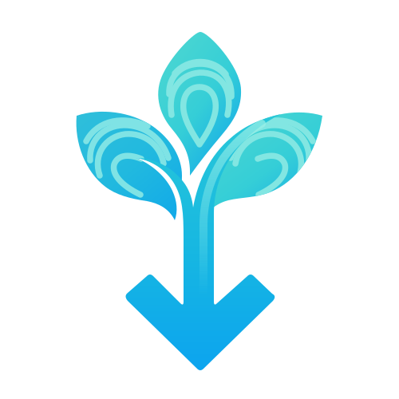

  

<h1 align="center"><a href="https://qtremors.github.io/acqua/">Acqua</a></h1>

  A private, expressive Android media downloader.

  

  
  

  
  
  

> [!NOTE]
> **Responsible use & privacy:** Only download content you own, have permission to save, or are legally authorized to access. Acqua has no ads, telemetry, or remote user tracking. Media and browser sessions stay on your device.

## Why Acqua

Acqua is a native Android media downloader designed for clarity, control, and privacy. It lets you inspect link previews, choose video/audio qualities, organize downloads by category, and download media in the background without intrusive ads or data collection.

## Download

Download the latest APK from [GitHub Releases](https://github.com/qtremors/acqua/releases) and install it on any device running Android 7.0 (API 24) or newer.

The universal APK bundles all architecture binaries (`arm64-v8a`, `armeabi-v7a`, `x86_64`, `x86`). Smaller architecture-specific APKs are also provided.

## Features

- **Private by design:** No ads, analytics, accounts, or telemetry. Media and browser cookies stay in app-private storage.
- **Dual engine processing:** Native direct extraction for fast carousel and direct media, with yt-dlp available for full quality, audio formats, metadata, and artwork.
- **Supported sources:** Download Instagram posts, reels, and carousels, direct media URLs, and YouTube, YouTube Music, or other compatible pages through yt-dlp or browser-assisted extraction.
- **Preview before downloading:** Inspect video dimensions, image resolutions, audio formats, and sizes before committing to a download.
- **Quality and format controls:** Choose the best available video or cap it from 2160p through 360p, and keep original audio or convert it to M4A or MP3.
- **Background queue:** Background downloads continue reliably when you leave the app, with progress notifications and automatic network retry.
- **In-app browser:** Browse and sign in to websites full-screen with app-private cookies. Downloads open above the live browser without losing your place or page state.
- **Organized storage:** Save files into categorized subfolders (`Images/`, `Videos/`, `Audio/`) with customizable filename patterns and template chips.
- **History & recovery:** Search, filter, share, and manage past downloads with missing-file detection and re-download support.
- **Modern Material 3 Expressive UI:** Built with dynamic segmented lists, smooth animations, and adaptive light/dark themes.

## Community and support

- Join the [Discord community](https://discord.gg/QgUjuNj9U8).
- Report bugs or request features through [GitHub Issues](https://github.com/qtremors/acqua/issues).
- Review changes in the [changelog](CHANGELOG.md) and public release notes.
- Read the [privacy policy](PRIVACY.md).

## Credits

Acqua is built by [Tremors](https://github.com/qtremors) with Kotlin and the Android platform. Thanks to the maintainers of:

- [AndroidX](https://developer.android.com/jetpack/androidx), [Jetpack Compose](https://developer.android.com/compose), [Material 3](https://m3.material.io/), and [Android Keystore](https://developer.android.com/training/articles/keystore)
- [Kotlin](https://kotlinlang.org/) and [Kotlin Coroutines](https://github.com/Kotlin/kotlinx.coroutines)
- [OkHttp](https://square.github.io/okhttp/)
- [youtubedl-android](https://github.com/yausername/youtubedl-android), [yt-dlp](https://github.com/yt-dlp/yt-dlp), [FFmpeg](https://ffmpeg.org/), and [Python](https://www.python.org/)
- [QuickJS-Android](https://github.com/cashapp/quickjs-android)
- [DM Sans](https://fonts.google.com/specimen/DM+Sans), [Manrope](https://fonts.google.com/specimen/Manrope), [Lucide](https://lucide.dev/), and [Simple Icons](https://simpleicons.org/) for the project website and visual presentation

The app's **Settings → App information → Open-source notices** screen lists all runtime libraries and their licenses. Each project remains the property of its respective authors and is used under its own license.

## For developers

Architecture, project structure, technology choices, setup, build commands, testing, convention checks, and release signing live in [DEVELOPMENT.md](DEVELOPMENT.md).

## License

Acqua is free software licensed under the **GNU General Public License v3 or later (GPLv3+)**.

Read [LICENSE.md](LICENSE.md) or review runtime notices in [THIRD_PARTY_NOTICES.md](THIRD_PARTY_NOTICES.md).

---

  Made by <a href="https://github.com/qtremors">Tremors</a>

